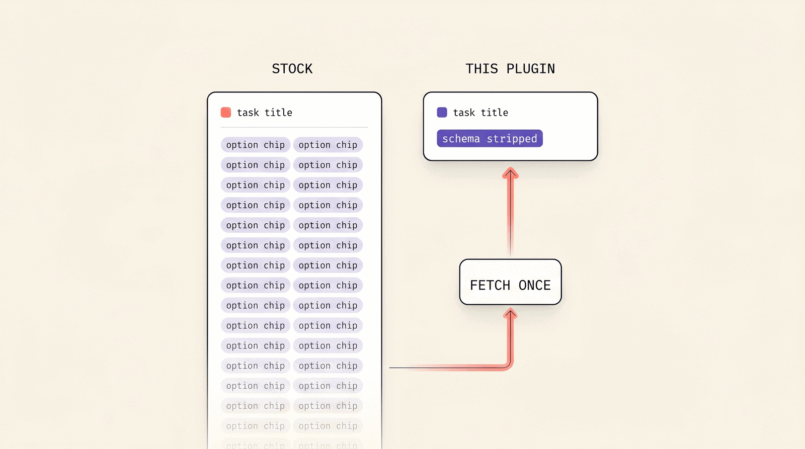
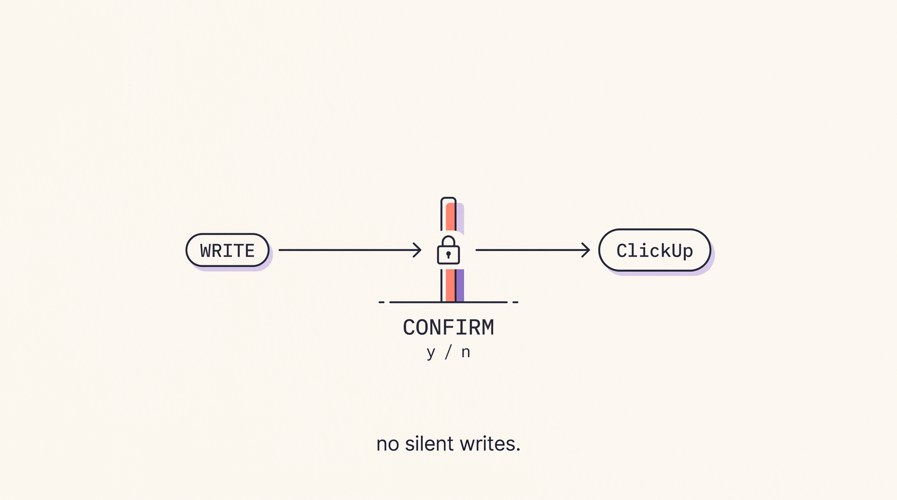
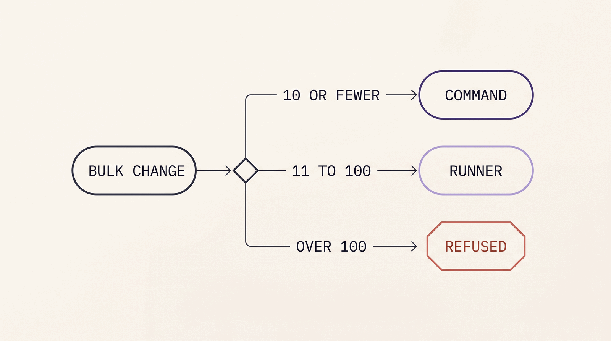
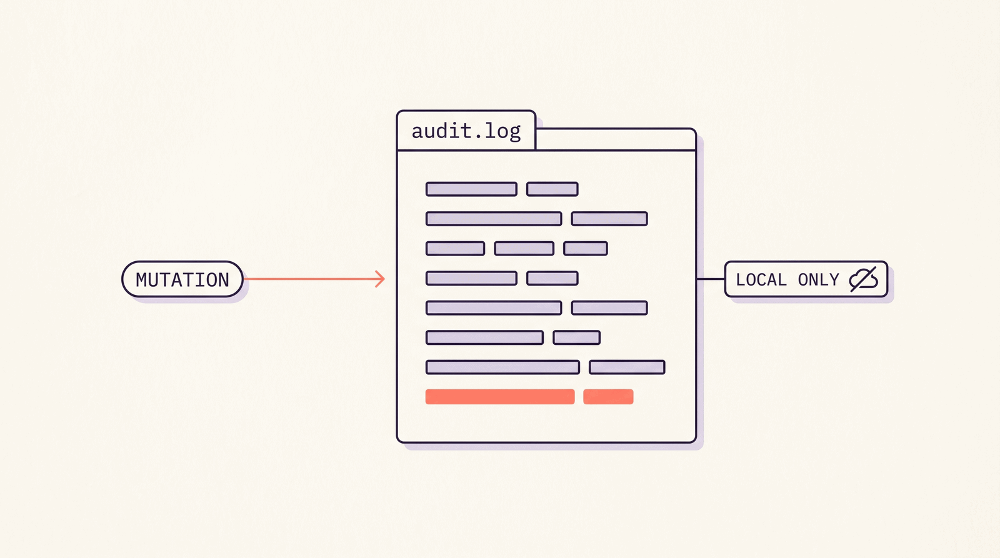

<p align="center">
  
</p>

<p align="center">
  
  
  
  
</p>

<p align="center">
  <b>Talk to ClickUp from Claude Code with token-disciplined task access and first-class, audited bulk operations.</b>
</p>

# ClickUp for Claude Code

You run real work in ClickUp, and you drive Claude Code from the terminal. The two should talk to each other. ClickUp's own hosted MCP makes that harder than it should be on a real workspace, in three specific ways.

First, access. The hosted MCP is OAuth-only - your personal API token is refused. And unless your Workspace pays for the Everything AI add-on, every connected client shares one rolling 24-hour pool of calls for the whole Workspace (1,000 per day on Business), with no way to even monitor usage. One teammate's busy afternoon rate-limits everyone until tomorrow. This plugin runs on your personal token against the public API - around 100 requests per MINUTE on standard plans, per person, with no shared daily pool.

Second, safety at scale. A mass change through the hosted MCP is an unaudited leap of faith. The moment a tool can touch a hundred tasks at once, the fear is rational. One bad call could reassign a sprint or delete a quarter of a board, and you would have no record of what happened. This plugin puts a hard, explicit confirmation in front of every write, with a capped bulk path, a second confirmation on bulk delete, a dry-run kill switch, an idempotent batch runner for large jobs, and a local audit log of every mutation.

Third, tokens. The hosted MCP has improved here (task summaries are compact by default now), but the moment you expand custom fields it still inlines each dropdown's full option schema on every task. This plugin strips `type_config` everywhere by default and serves the option catalogue exactly once per list, so even expanded reads stay lean.

A tool you are afraid to run at scale is not really a tool. This plugin exists so ClickUp control from Claude Code is fast, unmetered, and auditable enough to actually trust.

The plan is three steps - add the marketplace, install the plugin, paste your own ClickUp token. Then ask Claude to list a workspace and you are working.

Works with any ClickUp workspace. You supply your own personal token, and every person who uses the plugin supplies their own.

## Install

Standalone, just this plugin.

```
/plugin marketplace add juliandickie/clickup-plugin
/plugin install clickup@clickup
```

Or, if you use the aggregate outfit catalog, the plugin is also listed there and installs the same way with `clickup@outfit`.

## Authentication

You need a ClickUp personal API token. Create one in ClickUp at Settings - Apps - Generate API Token. It starts with `pk_`. The plugin uses it read-write against your own account, so it can do anything you can do in the ClickUp UI.

Supply the token in any one of these ways. The plugin resolves them in this order.

1. The plugin config prompt - on install Claude Code asks for your ClickUp API token and stores it as a sensitive plugin setting.

2. The `CLICKUP_API_TOKEN` environment variable - set it to the `pk_` token directly, or to a 1Password secret reference like `op://Vault/ClickUp/credential` (requires the `op` CLI installed and signed in).

3. A machine-global file at `~/.config/clickup-plugin/config.toml` containing:

```toml
api_token = "pk_your_token_here"
```

The `api_token` in config.toml may also be an `op://` reference. If your machine is signed in to MORE THAN ONE 1Password account, the `op` CLI needs to be told which account holds the item - set `CLICKUP_OP_ACCOUNT` (env) or `op_account` (config.toml) to that account's sign-in address or account id, for example:

```toml
api_token = "op://Private/ClickUp API Token/credential"
op_account = "my-team.1password.com"
```

The token is never written to any repository, never logged, and never sent anywhere except `api.clickup.com`.

## Token discipline - the core difference

<p align="center">
  
</p>

ClickUp returns every custom field's full option list (`type_config`) on every task. On a list with dozens of options across hundreds of tasks that is tens of thousands of redundant tokens per pull. `list_tasks`, `get_task`, and `filter_workspace_tasks` strip `type_config` by default. When you genuinely need the option catalogue, call `list_custom_fields` once for the list, or pass `include_field_schema: true` on a specific call. ClickUp's hosted MCP now defaults to compact summaries too, but its expanded custom-field reads still inline the schemas per task - this plugin stays lean even when you opt into field values.

## Safety model

<p align="center">
  
</p>

Every write is gated. The write tools refuse to run unless invoked through a `/clickup-*` command that has shown you a confirmation summary and received an explicit yes. There is no path to a silent write.

- Bulk operations via the MCP tool are recommended for up to 10 tasks. Sets larger than 10 use the bundled clickup-batch runner. The MCP tool still hard-refuses more than 100 as a safety backstop.

- A bulk delete needs a second explicit confirmation in addition to the normal one. A 100-task delete cannot happen by accident.

- Set `CLICKUP_DRY_RUN=1` to block all writes globally. In dry-run, write tools return a clearly labelled synthetic response and never touch ClickUp. Reads still work.

- Every mutating call is appended to a local audit log at `~/.local/share/clickup-plugin/audit.log` with a timestamp, the operator, the operation, your confirmation summary, and the affected ids. The audit write is best-effort and never aborts your operation.

## What you get

Skills (these activate on their own when relevant).

- `clickup-task-search` - find and summarise tasks in a list or space.

- `clickup-list-audit` - a canonical snapshot of a list - counts by status, custom-field coverage, relationship density.

- `clickup-bulk-plan` - plan a bulk change and preview it. This skill only ever plans. It never writes.

Commands (explicit, confirmed writes).

- `/clickup-task` - create or update a single task, after showing you a confirmation summary and waiting for your yes.

- `/clickup-bulk-apply` - apply a previously previewed bulk change to up to 10 tasks, after explicit confirmation. Larger sets use the bundled clickup-batch runner. Bulk deletes require a second, separate confirmation.

MCP tools (Claude calls these as needed, with the safety rules above).

- Navigation - `list_workspaces`, `list_spaces`, `list_folders`, `list_lists`, `get_list`, `list_members`.

- Read - `list_tasks` (auto-paginated, schema-stripped by default), `get_task`, `list_custom_fields`, `get_task_comments`, `get_comment_replies`, `filter_workspace_tasks` (cross-list filtering by status, assignee, tag, and date in one call).

- Docs, read-only on ClickUp API v3 - `search_docs`, `list_doc_pages` (table of contents first, token-disciplined), `get_doc_pages` (markdown).

- Single writes (gated) - `create_task`, `update_task`, `delete_task`, `set_custom_field`, `add_comment`, `set_task_relationship` (link, depends_on, blocks), `remove_task_relationship`.

- Bulk (gated, capped) - `bulk_update_tasks`.

## API v3 posture

ClickUp is migrating its public API to v3 one endpoint group at a time. This plugin runs v2 and v3 side by side - v2 remains the default for the whole task surface (ClickUp has shipped no v3 equivalents there yet), and each capability opts into v3 as ClickUp ships and we verify it. Docs is the first - the three Docs tools run on `/api/v3/`. New v3 groups will be adopted the same way, tested against the live API with v2 as the working backstop, until a full cutover is possible.

## Bulk and large jobs

<p align="center">
  
</p>

`bulk_update_tasks` is recommended for sets of up to 10 tasks. For larger sets, or any job you want to run idempotently with a dry-run preview and a written report, use the `clickup-batch` runner. It ships with this plugin (installed as `clickup-batch` on PATH). It is dry-run by default, replaces a marker block in place so re-runs do not duplicate, and paces writes under ClickUp's rate limit. The MCP bulk tool hard-refuses more than 100 tasks as a safety backstop, but the recommended path for more than 10 tasks is the runner.

## The audit log

<p align="center">
  
</p>

Every mutating call appends one line to `~/.local/share/clickup-plugin/audit.log` - timestamp, operator, operation, your confirmation summary, and the affected task ids. It is local only and never uploaded. The audit write is best-effort. If it fails (a read-only disk, for example) it logs to stderr and your operation still completes. The log is the answer to "what did this actually change", and it is yours alone.

## Requirements

- Node 18 or newer (the bundled MCP server runs on it).

- A ClickUp personal token (`pk_`).

## Optional configuration

- `CLICKUP_BASE_URL` - override the API base (defaults to `https://api.clickup.com/api/v2`). A value ending in `/v2` gets its v3 root derived automatically (`/v2` swapped for `/v3`); any other custom value is used unchanged for both versions. An unresolved `${...}` value is ignored and the default is used.

- `CLICKUP_DRY_RUN` - set to `1` to block all writes.

## Notes

This repository is generated. It is the lean, installable payload built and published from a separate development monorepo. Do not send pull requests here - see CONTRIBUTING.md. Day-to-day usage, examples, and troubleshooting are in USAGE.md.

## License

MIT.
